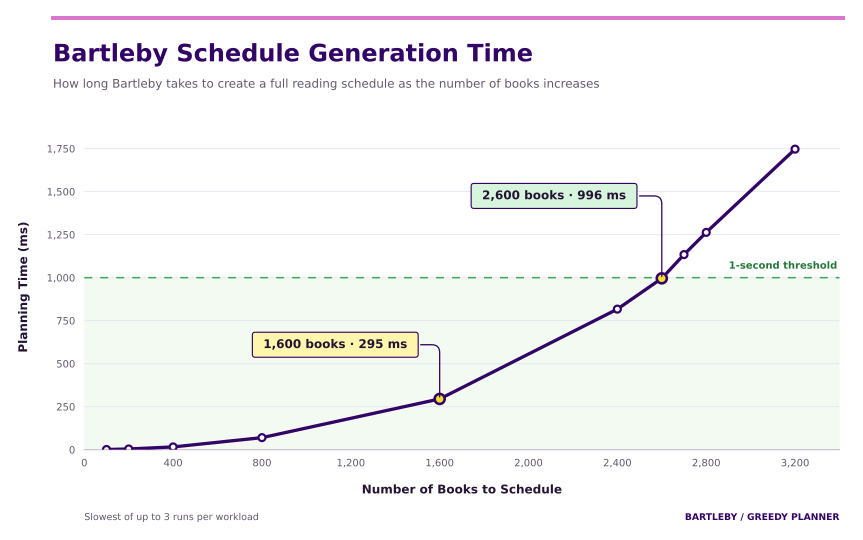

# 

*Read More Books.*

## About

Bartleby is a personal **reading schedule optimizer** that generates a daily reading plan based on your book backlog. Let it know what you want to read, how fast you read, how much time you have, and it will create a schedule that fits you.

## Where do I get Bartleby?

You can download Bartleby from the [official website]((https://www.readbartleby.com/)).

You can also try it out at [the live demo](https://www.readbartleby.com/demo).

## How fast is Bartleby?

Bartleby uses efficient greedy algorithms to quickly create daily reading schedules. In benchmarks, Bartleby can create 10 years of daily reading schedules for 2,600 books in under a single second. For 1,600 books, it only takes 295 milliseconds. Bartleby can use this speed to update your schedule whenever you make a change like adding a book, changing how difficult a book is, changing the priority of a book, removing a book, or adding blockers to a book.

## Why Bartleby?

Bartleby was mainly built for myself. I wanted to visually see just how many books a year I could read with a small time commitment each day. I'm a fairly slow reader which makes it pretty hard to believe that I can make meaningful progress on my backlog. And having a giant backlog of books doesn't feel as life affirming to me as it is for [Umberto Eco and Nassim Nicholas Taleb](https://en.wikipedia.org/wiki/Antilibrary). Ultimately, this became a fun way to get myself to read more. I hope that others find it useful too.

## Issue Information

Issues are currently handled on GitHub, but also have a folder on the filesystem for easier local management: `issues/`. Each issue is a markdown file with a title, description, and acceptance criteria. The issue number is the filename (e.g., `1.md` for issue #1). This is probably going to change in the future, but I like using it like this for now.

You can run `just sync` or `pnpm issues:sync` to sync issues between GitHub and the local filesystem. This will create new files for any new issues on GitHub, and update existing files with any changes. It will also create new issues on GitHub for any new files in the `issues/` folder. Moving from Open to Closed in the folder will also Close the issue on GitHub. I don't have justifications for doing this this way.
