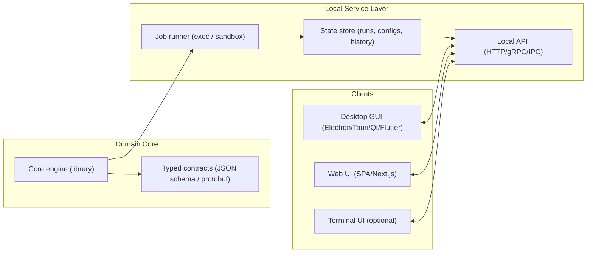
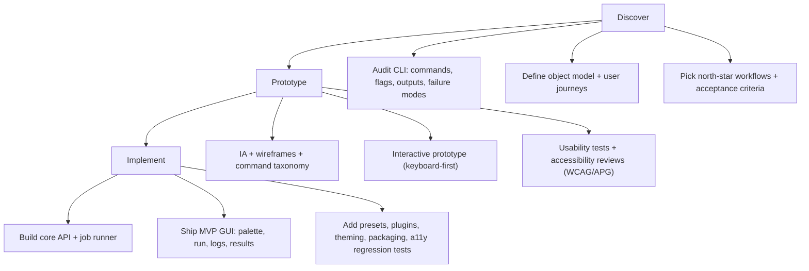

# Modern GUI Program Patterns for CLI-to-GUI Redesign

## Technology stacks and libraries for cross-platform GUI

CLI-to-GUI projects usually succeed when the **domain engine** (what your CLI does) becomes a reusable “core,” and the GUI is treated as one or more **front-ends** over that core. The stack decision is therefore less about “which GUI toolkit is best” and more about: (a) how you will package and distribute, (b) how you will run/secure local processes, (c) whether you need plugin ecosystems, and (d) how strongly you need native look/feel.

### Stack-to-app-type mapping with trade-offs

The table below maps the stacks you requested to common CLI-to-GUI app shapes and the most important trade-offs (performance, bundle size, native feel, dev experience). Claims here are anchored to official documentation about each framework’s scope and architecture.

| Stack / toolkit | Best-fit CLI-to-GUI app types | What you get (why teams choose it) | Main trade-offs to plan for |
|---|---|---|---|
| Electron | IDE-like tools, dev utilities, database clients, DevOps consoles, plugin-heavy “workbenches” | One codebase across desktop OS’s using the web stack; deep OS integration possibilities; common for extensible tools. Electron is built around bundling Chromium + Node.js. citeturn0search2 | Larger footprint and memory profile typical of Chromium-based shells; “native feel” depends on design system discipline; accessibility must be engineered deliberately (web a11y fundamentals still apply). citeturn0search0turn0search4 |
| Tauri | Utilities, secure internal tools, lightweight desktop shells for existing web apps | Small, fast desktop binaries with a Rust-capable backend and a web frontend approach; strong fit when you want desktop distribution without “shipping a full browser.” citeturn0search3turn0search19 | More architectural decisions up front (frontend/backend boundary, IPC); plugin ecosystem is smaller than Electron’s; some tricky platform integration work may require native/Rust expertise. citeturn0search3 |
| Flutter | Multi-platform apps (desktop + mobile), workflows that need consistent UI across OS’s | One codebase targeting mobile/web/desktop with a natively compiled approach; highly consistent UI and strong “single design language” experience. citeturn1search0 | Larger learning curve if your team is not in Dart/Flutter; “native feel” is achievable but often requires extra effort to align with platform conventions; desktop integrations sometimes require platform channels. citeturn1search0 |
| React Native | Mobile-first companions for your CLI, lightweight client apps that share logic with web | Cross-platform mobile development model; large ecosystem; strong for companion apps that focus on a subset of CLI workflows. citeturn1search1turn1search10 | Desktop targets are not the core story; performance is usually good but depends on architecture; OS-native polish requires platform-specific attention. citeturn1search1 |
| Web SPA (React / Vue / Svelte) | Web dashboards, “localhost web UI” for a local CLI daemon, admin consoles | Rapid UI iteration with component model; easy distribution (a URL) and easy integration with hosted/cloud backends. React/Vue/Svelte all center on component-based UI development. citeturn32search0turn32search1turn32search2 | OS integrations are limited without a desktop shell; offline/local filesystem needs more architecture; accessibility is your responsibility (but WCAG + ARIA guidance is mature). citeturn0search0turn0search4turn0search5 |
| Next.js (web framework) | Web-first “app + API” bundles; SaaS-style UI over CLI-driven backends | A React framework that bundles UI + many production optimizations; good when your “GUI” is really a product with an API layer. citeturn32search3turn32search11 | You must own web deployment and security model; local-first scenarios still need a local agent/daemon pattern. citeturn32search3 |
| Qt | Desktop-first professional tools (DB clients, IDE-like apps, system utilities) where native integration matters | Mature cross-platform native framework used for complex tooling; strong widget set and OS integration story. citeturn1search2 | C++/Qt learning curve (unless using bindings); licensing considerations; your team must be comfortable shipping native installers per OS. citeturn1search2 |
| GTK 4 | Linux-first desktop GUIs (or GNOME-aligned apps) | Modern Linux desktop toolkit; good for Linux-native experiences and distributions. citeturn1search3 | Cross-platform beyond Linux is possible but not the primary “sweet spot;” visual parity with macOS/Windows requires more effort. citeturn1search3 |
| SwiftUI | macOS/iOS first-class native GUI (possibly one platform at a time) | Declarative Apple-native UI; excellent platform fit for macOS-first redesigns. citeturn2search0 | Apple ecosystem focus; multi-platform beyond Apple requires separate implementations. (Company: entity["company","Apple","consumer electronics company"].) citeturn2search0 |
| WinUI 3 | Windows-first native GUI (enterprise/internal tooling especially) | Modern Windows UI framework; aligns with Windows design language and Windows App SDK direction. citeturn2search1 | Windows-only; cross-platform requires additional shells or separate implementations. (Company: entity["company","Microsoft","technology company"].) citeturn2search1 |

### Practical guidance for choosing

If your CLI is likely to become a **broad workbench** (many subcommands, plugins, workflows, and rich outputs), Electron or a web SPA + desktop shell tends to match the product shape—this is the “VS Code / IDE” pattern of commands + views + extension points. citeturn3search0turn4search14turn0search2

If the GUI is primarily a **thin, safe controller** over a robust CLI engine (start jobs, show logs, configure runs, browse artifacts), Tauri is often attractive because it supports a “small shell + strong backend boundary” mental model. citeturn0search3turn0search19

If you want a **unified UI across desktop + mobile** with minimal platform divergence, Flutter (or a Flutter-first approach with platform-specific adapters) is a strong contender. citeturn1search0

If your first GUI step is “**terminal GUI**” (TUI) rather than a full windowed app, frameworks like Textual can be a pragmatic intermediate deliverable and an adoption bridge for CLI-native users. citeturn31search3turn31search13

## Accessibility checklist, testing, and prototyping deliverables

### Accessibility checklist for CLI-to-GUI applications

Use WCAG 2.2 as the baseline for functional accessibility requirements, and WAI‑ARIA Authoring Practices (APG) as the pragmatic implementation guide for common components (dialogs, menus, comboboxes, tables, etc.). citeturn0search0turn0search4turn0search5

Below is a checklist tuned to common CLI-to-GUI surfaces like command palettes, logs viewers, and data tables.

| Area | Checklist items that commonly fail | What “good” looks like |
|---|---|---|
| Keyboard-only | Focus traps in modals; ambiguous focus order; “tab stops” missing on icon buttons | Every interactive control is reachable; visible focus; predictable order; Escape closes dialogs; shortcuts never steal OS-level accessibility keys (a real-world risk surfaced by launcher tools). citeturn24search11turn24search13 |
| Command palette | Listbox/combobox semantics wrong; results not announced; typeahead breaks screen readers | ARIA patterns match APG guidance; results are announced; selection changes are perceivable; “no results” is announced and visible. citeturn0search4turn0search5 |
| Tables & grids | Screen reader reads “blank”; sorting/filter status is invisible | Table headers and sort state are exposed; row/column counts and selection are announced; filtering state is visible and programmatically determinable. citeturn0search0turn0search4 |
| Logs viewer & streaming output | New lines “steal” focus; live regions spam screen readers; copy/select is hard | Clear pause/follow mode; accessible “copy last run,” “copy selection,” and “open as text buffer” mechanics; live update behavior respects user control. (Terminal accessibility patterns are explicitly discussed in tooling ecosystems.) citeturn27search6turn25search0 |
| Color & contrast | Status conveyed by color only; low contrast for alerts/badges | Contrast meets target; error/warn/success always has text/icon affordances; high contrast themes don’t break UI. (Real products track issues here.) citeturn12search3turn27search3 |
| Zoom, text sizing | Layout breaks at 200% zoom; truncated labels | UI reflows; truncation has tooltips and accessible names; global zoom supported where possible. citeturn5search2turn28search3 |
| Screen reader support | Unlabeled icons; custom widgets not exposed | Accessible names everywhere; meaningful landmarks/regions; tested with NVDA/JAWS/VoiceOver where relevant. citeturn7search3turn28search3turn20search1 |
| Accessibility posture | No public stance; unknown known-issues | Publish an accessibility statement and/or conformance report approach; track and prioritize. Several mature products show explicit statements and audit methods. citeturn12search3turn7search3turn13search2 |

### Testing recommendations

A reliable strategy combines automated checks with manual assistive-technology testing. Slack’s engineering write-up on automated accessibility testing highlights why automation is valuable but incomplete citeturn20search9, and GitHub’s conformance reporting documents real toolchains (keyboard-only, NVDA/JAWS, axe, contrast analyzer, platform settings like high contrast/zoom). citeturn7search3

Recommended test layers:

1. **Automated a11y tests in CI** for common regressions (missing labels, invalid ARIA, contrast linting where feasible). Use automation as “smoke tests,” not as proof of compliance. citeturn20search9turn7search3  
2. **Keyboard-only testing** as a release gate: every flow end-to-end with no mouse. This is explicitly cited as an evaluation method in conformance reporting. citeturn7search3  
3. **Screen reader scenario testing** (NVDA + JAWS on Windows, VoiceOver on macOS; TalkBack on Android if you ship mobile). JetBrains and DBeaver explicitly document screen reader support expectations and options, which is a good model for your own QA checklist. citeturn5search2turn28search3  
4. **Zoom/high-contrast validation**: verify at 200% zoom and in OS contrast themes; real-world issue trackers show how easily these break in practice. citeturn27search3turn12search3  
5. **Component-level ARIA reviews** against the APG patterns for key components you will ship (command palette, dialogs, menus, tables). citeturn0search4turn0search5

### Prototype deliverables and component inventory

A CLI-to-GUI transition benefits from treating the GUI as a product redesign rather than “put flags into a form.” Deliverables should explicitly test: discoverability vs speed, safety vs power, and reproducibility vs convenience.

**Low-fidelity deliverables** (fast learning artifacts)
- Task inventory mapped from CLI subcommands/actions into user goals (e.g., “run,” “inspect,” “configure,” “export,” “share”).  
- Information architecture: object model + navigation map (what’s the primary entity? what are secondary entities?).  
- Wireframes for the “primary loop” screens: command palette, run configuration, run progress, output/logs, results browser.  
- Clickable lo-fi prototype to validate flow and terminology (key for command naming).

**High-fidelity deliverables** (implementation-ready artifacts)
- Design tokens (spacing, typography, color roles, elevations) and component states (hover/focus/disabled/error).  
- Interaction specs for keyboard-first usage (shortcuts, focus order, command palette behavior).  
- Accessibility annotations on complex components (palette, tables, logs) aligned to WCAG/APG. citeturn0search0turn0search4turn0search5  
- Hi-fi prototype (Figma or equivalent) plus a usability test script emphasizing “new user finds feature without reading docs” and “expert completes task without leaving keyboard.” (Figma provides explicit guidance on product accessibility features and keyboard use, making it a good prototyping environment for keyboard-first flows.) citeturn21search1turn21search7

**Sample component inventory for a CLI-to-GUI app**
- **Command palette** (global): search commands, entities, recent runs; shows shortcuts and categories. (Patterns strongly evidenced by VS Code, Lens, Metabase, Grafana, Warp.) citeturn3search0turn11search9turn16search20turn12search2turn25search1  
- **Run configuration form**: structured parameters with validation, inline help, and “copy equivalent CLI command.”  
- **Preset manager**: save/load/share run configurations; optional “git-backed” presets for teams.  
- **Job runner / progress panel**: queue view, cancellation, retries, timestamps, exit codes.  
- **Live output panes**: logs viewer with filters, search, follow/pause, copy/export; optional block-based grouping (Warp-style). citeturn25search0turn10search12  
- **Results table**: sortable/filterable table, column picker, export CSV/JSON.  
- **Details inspector**: right-side pane with metadata, raw JSON/YAML, and related actions (copy ID, open file, rerun).  
- **Artifacts viewer**: files produced by runs, with preview and download/export.  
- **Notifications / toasts**: success/failure with actionable follow-ups (view logs, open report).  
- **Settings**: theme, accessibility options (zoom, reduced motion), keybinding editor (VS Code/DataGrip model). citeturn4search2turn6search5  
- **Plugin/extension manager** (if applicable): marketplace, enable/disable, permissions. (Lens extension API and Raycast’s extension platform are useful reference models.) citeturn11search2turn23search12

## Reference architecture and phased plan

### Recommended architecture for a CLI-to-GUI product

The architecture below keeps your existing CLI logic as the **engine**, and introduces a GUI that interacts through a stable API boundary. This supports: testability, future headless automation, and multiple clients (desktop + web + TUI) over time.

This split mirrors patterns used by “workbench” tools that treat commands as first-class actions (e.g., command palettes with extension points), while keeping operational logic testable and reusable. citeturn3search0turn11search2turn23search12

### Three-phase redesign plan timeline

WCAG and ARIA guidance should be applied starting in the prototype phase (not deferred), and regression testing should become part of implementation completion criteria—both are repeatedly reinforced by real product practice (formal accessibility statements, conformance reporting, and automated testing strategies). citeturn0search0turn0search4turn20search9turn7search3turn12search3